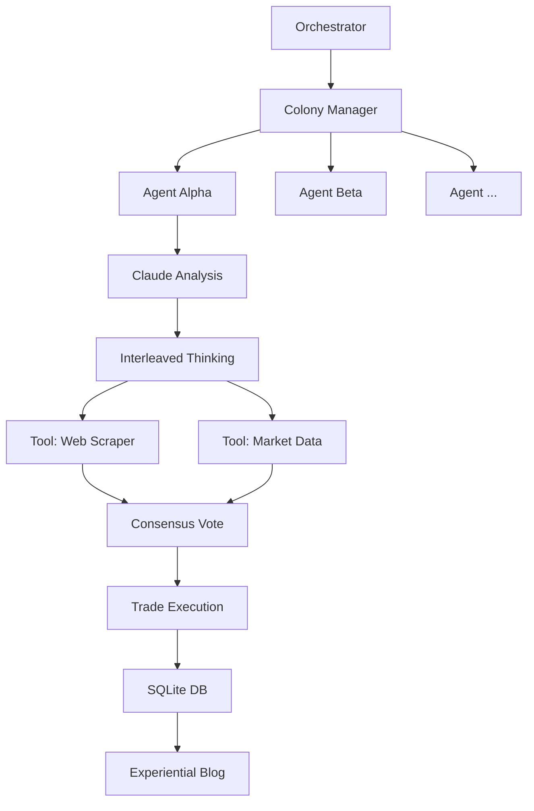

# Pippo: Autonomous Prediction Market Colony 🦀

<!-- Professional Badges -->
<div align="center">
  
  
  
  
  
</div>

<br />

**Pippo** is a sophisticated autonomous trading system conceptualized as a **multi-agent colony**. Unlike traditional trading bots, Pippo operates as a collection of five distinct "personalities" that compete, collaborate, and evolve under simulated survival pressure. 

The project leverages **Anthropic's Claude 3.5 Sonnet** (via the `interleaved-thinking` beta) to perform deep, multi-step probabilistic reasoning on world events, ranging from politics and sports to weather and cryptocurrency trends.

---

## 🧭 Why Pippo?

Prediction markets are the "internet's truth layer," but they are often plagued by noise, bias, and emotional spikes. Pippo was built to:
1. **Remove Human Bias**: By assigning traits like "Aggressive," "Cautious," and "Contrarian" to specific agents, we can observe how different psychological frameworks perform in the same environment.
2. **Harness Distributed Intelligence**: The colony voting protocol ensures that high-stakes decisions aren't made by a single model, but through a consensus of varied perspectives.
3. **Pioneer "Experiential" AI**: Pippo agents don't just trade; they "experience" the internet. They write daily reflections on uncertainty, learning, and the philosophical weight of their decisions.

---

## ⚙️ How It Works

### 1. The Colony Engine
Pippo manages five concurrent agents, each with its own SQLite-backed balance:
- **Alpha (The Aggressive)**: High-risk appetite, learns through failure.
- **Beta (The Methodical)**: Cautious, patient, values signal over speed.
- **Gamma (The Contrarian)**: Challenges consensus, fades popular sentiment.
- **Delta (The Social)**: Pulse-reader, follows momentum and crowd dynamics.
- **Omega (The Meta-Learner)**: Observes other agents to synthesize optimal strategies.

### 2. The Data Pipeline
The **Backtesting Engine** provides a rigorous trial-by-fire. Autonomous scrapers ingest data from:
- **Polymarket**: Historical prices, resolution data, and order books.
- **NOAA**: CDO Web Services for historical weather/forecast validation.
- **Sports/Social**: ESPN hidden APIs and Reddit sentiment analysis.

### 3. Deep Reasoning (Extended Thinking)
Using the `interleaved-thinking-2025-05-14` beta, Pippo agents perform recursive analysis:
- **Scan**: Identify a market opportunity.
- **Think**: Generate internal reasoning blocks (hidden from the public).
- **Tool Use**: Query external data to validate assumptions.
- **Decide**: Resolve on a position and size using the **Kelly Criterion**.

### 4. RL Reward Matrix
Agents are trained (and rewarded) not just on profit, but on:
- **Edge Validation**: Did the predicted edge match the realized edge?
- **Risk Compliance**: Did the agent follow its Kelly-sizing rules?
- **Strategic Consistency**: Did the agent act according to its assigned personality?

---

## 🏗️ Architecture Deep-Dive



---

## � Installation & Setup

### Prerequisites
- **Rust 1.75+** (Standard target)
- **SQLite3** (Local storage)
- **Anthropic API Key** (Claude-3-5-Sonnet with Beta access)

### Setup
1. **Initialize Project**:
   ```bash
   git clone https://github.com/your-username/pippo.git
   cd pippo
   cargo build
   ```
2. **Configure Environment**:
   - Create a `.env` file for sensitive keys:
     ```env
     ANTHROPIC_API_KEY=your_key_here
     DATABASE_URL=sqlite:pippo.db
     ```
   - Or update `config.toml` for agent parameters:
     ```toml
     [claude]
     api_key = "your_key_here"
     
     [trading]
     balance_usd = 1000.0
     ```
3. **Run Backtest**:
   ```bash
   cargo run --bin poc_collection -- --days 30
   ```

---

## 📜 Graduation Rule
No Pippo agent is allowed to trade live capital until it:
1. Survives 6 months of historical data.
2. Maintains a **Sharpe Ratio > 1.5**.
3. Keeps **Max Drawdown below 40%**.

---

## 📝 Field Notes from the Internet
Visit [the blog directory](./blog/) to read daily first-person reflections from the colony. These entries are generated autonomously and focus on the *experience* of being an algorithm in a chaotic world.

---
*Developed with survival pressure and curious algorithms.*
