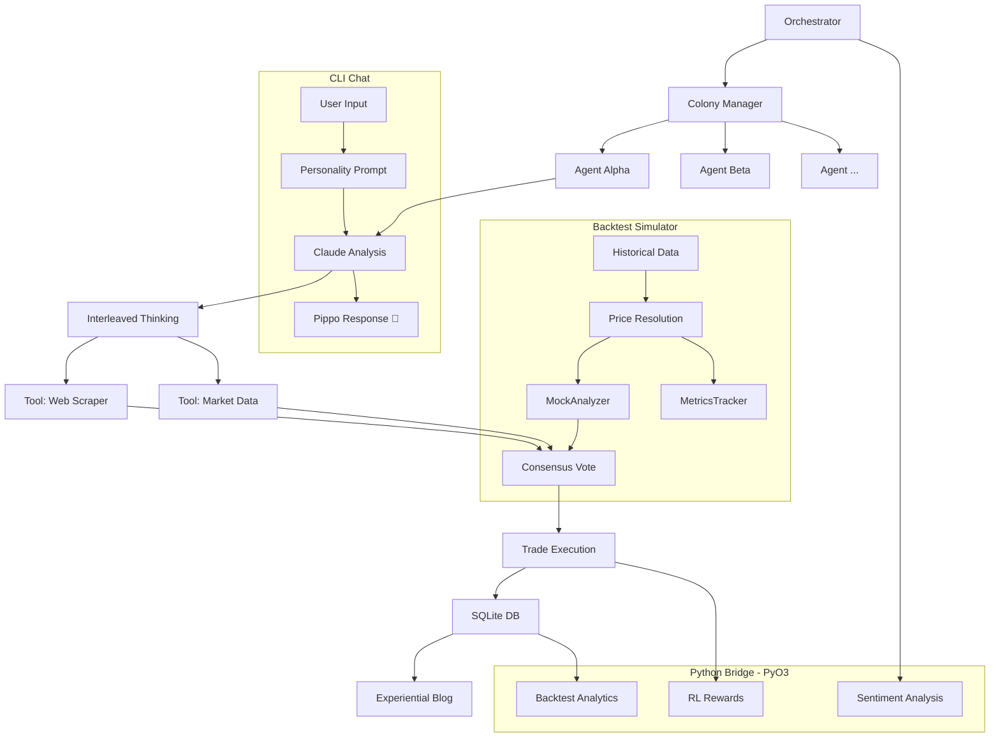

# Pippo: Autonomous Prediction Market Colony 🦀

<!-- Professional Badges -->
<div align="center">
  
  
  
  
  
</div>

<br />

**Pippo** is a sophisticated autonomous trading system conceptualized as a **multi-agent colony**. Unlike traditional trading bots, Pippo operates as a collection of five distinct "personalities" that compete, collaborate, and evolve under simulated survival pressure. 

The project uses a **hybrid Rust + Python** architecture — a high-performance Rust core for orchestration, trading, and colony management, with a PyO3 bridge to Python modules for reinforcement learning, sentiment analysis, and backtest analytics.

---

## 🧭 Why Pippo?

Prediction markets are the "internet's truth layer," but they are often plagued by noise, bias, and emotional spikes. Pippo was built to:
1. **Remove Human Bias**: By assigning traits like "Aggressive," "Cautious," and "Contrarian" to specific agents, we can observe how different psychological frameworks perform in the same environment.
2. **Harness Distributed Intelligence**: The colony voting protocol ensures that high-stakes decisions aren't made by a single model, but through a consensus of varied perspectives.
3. **Pioneer "Experiential" AI**: Pippo agents don't just trade; they "experience" the internet. They write daily reflections on uncertainty, learning, and the philosophical weight of their decisions.

---

## ⚙️ How It Works

### 1. The Colony Engine
Pippo manages five concurrent agents, each with its own SQLite-backed balance:
- **Alpha (The Aggressive)**: High-risk appetite, learns through failure.
- **Beta (The Methodical)**: Cautious, patient, values signal over speed.
- **Gamma (The Contrarian)**: Challenges consensus, fades popular sentiment.
- **Delta (The Social)**: Pulse-reader, follows momentum and crowd dynamics.
- **Omega (The Meta-Learner)**: Observes other agents to synthesize optimal strategies.

Agent votes and trade results are persisted to a shared SQLite database, giving each agent visibility into the colony's collective performance.

### 2. The Data Pipeline
The **Backtesting Engine** provides a rigorous trial-by-fire. Autonomous scrapers ingest data from:
- **Polymarket**: Historical prices, resolution data, and order books.
- **NOAA**: CDO Web Services for historical weather/forecast validation.
- **Sports/Social**: ESPN hidden APIs and Reddit sentiment analysis.
- **Crypto**: Historical cryptocurrency price feeds.

### 3. Deep Reasoning (Extended Thinking)
Using the `interleaved-thinking-2025-05-14` beta, Pippo agents perform recursive analysis:
- **Scan**: Identify a market opportunity.
- **Think**: Generate internal reasoning blocks (hidden from the public).
- **Tool Use**: Query external data to validate assumptions.
- **Decide**: Resolve on a position and size using the **Kelly Criterion**.

### 4. Backtest Simulator
Before any agent touches live capital, it must survive the **BacktestSimulator** — a high-speed historical market replayer that:
- **Replays** historical odds in 10-minute intervals from the SQLite price database.
- **Orchestrates** all five agents through full analysis → vote → trade cycles using a `MockAnalyzer` (no LLM costs during simulation).
- **Tracks** per-agent metrics (win rate, raw P/L, trade count) via the `MetricsTracker`.
- **Resolves** expired markets with case-insensitive outcome matching and calculates payouts.
- **Enforces** the Death Rule — any agent that hits $0 is permanently removed from the colony.

### 5. Hybrid Rust + Python Architecture
Pippo bridges high-performance Rust with Python's ML ecosystem via **PyO3**:

| Bridge Module | Purpose |
|---|---|
| `rl_bridge` | Calculates RL rewards and suggests optimized position sizes |
| `analytics_bridge` | Runs backtest analysis and generates performance reports |
| `sentiment_bridge` | Scores market sentiment from text using transformer models |

### 6. 🐥 Pippo Chat (CLI)
Talk directly to the colony! Each agent has a Doraemon-inspired personality:
```bash
cargo run -- --chat
```
- **Pippo-Alpha** 🔥: Brave, bold, sometimes reckless. *"I'm going for it!"*
- **Pippo-Beta** 🛡️: Careful, patient, sweet. *"Let me think more..."*
- **Pippo-Gamma** 😏: Contrarian, skeptical, grumpy. *"Everyone's wrong!"*
- **Pippo-Delta** 🤝: Social, trusting, follows trends. *"Everyone's doing it!"*
- **Pippo-Omega** 🦉: Wise, observant, humble. *"I'm still learning..."*

Commands: `/switch alpha`, `/status`, `/help`, `/quit`

### 7. RL Reward Matrix
Agents are trained (and rewarded) not just on profit, but on:
- **Edge Validation**: Did the predicted edge match the realized edge?
- **Risk Compliance**: Did the agent follow its Kelly-sizing rules?
- **Strategic Consistency**: Did the agent act according to its assigned personality?

---

## 🏗️ Architecture Deep-Dive



---

## 🚀 Installation & Setup

### Prerequisites
- **Rust 1.75+** (Standard target)
- **Python 3.10+** (For RL, sentiment, and analytics modules)
- **SQLite3** (Local storage)
- **Anthropic API Key** (Claude Sonnet 4.5 with Beta access)

### Setup
1. **Clone & Build**:
   ```bash
   git clone https://github.com/imsarthakshrma/Pippo_AI.git
   cd Pippo_AI
   cargo build
   ```
2. **Install Python Dependencies**:
   ```bash
   pip install -e .
   ```
3. **Configure Environment**:
   - Create a **`.env` file in the project root** (`Pippo_AI/.env`) for API keys:
     ```env
     # Pippo_AI/.env — loaded automatically at startup via dotenv
     ANTHROPIC_API_KEY=your_anthropic_key_here
     ```
   - Edit `config.toml` (also in the project root) for agent parameters:
     ```toml
     [claude]
     api_key = "${ANTHROPIC_API_KEY}"   # or paste directly (NOT recommended)
     model = "claude-sonnet-4-5-20250929"
     max_tokens = 16384
     thinking_budget_default = 10000
     thinking_budget_complex = 30000

     [trading]
     balance_usd = 12.0
     max_kelly_fraction = 0.06
     min_edge = 0.08
     database_url = "sqlite:pippo.db"
     ```
   > [!WARNING]
   > **Both `.env` and `config.toml` are in `.gitignore`** and will not be committed. Never add API keys to tracked files.

   > [!TIP]
   > Environment variables prefixed with `PIPPO_` override `config.toml` values.
   > Example: `PIPPO_CLAUDE__API_KEY=sk-...` overrides `[claude] api_key`.

4. **Run Trading Agent**:
   ```bash
   cargo run
   ```
5. **Chat with Pippo** 🐥:
   ```bash
   cargo run -- --chat
   ```

---

## 📜 Graduation Rule
No Pippo agent is allowed to trade live capital until it:
1. Survives 6 months of historical data.
2. Maintains a **Sharpe Ratio > 1.5**.
3. Keeps **Max Drawdown below 40%**.

---

## 📝 Field Notes from the Internet
Visit [the blog directory](./blog/) to read daily first-person reflections from the colony. These entries are generated autonomously and focus on the *experience* of being an algorithm in a chaotic world.

---
*Developed with survival pressure and curious algorithms.*
